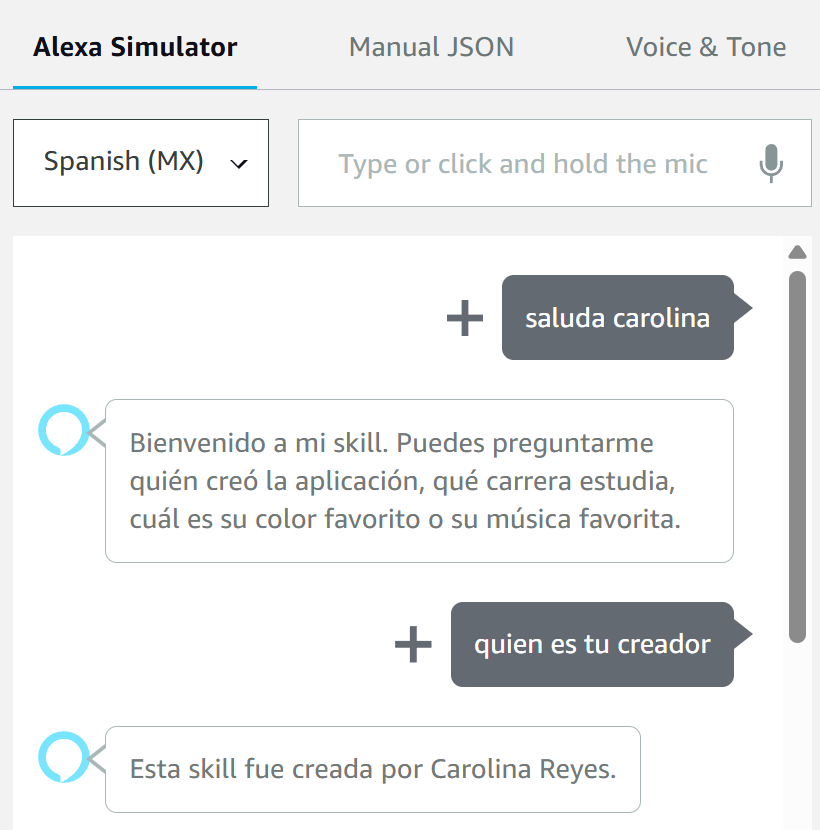
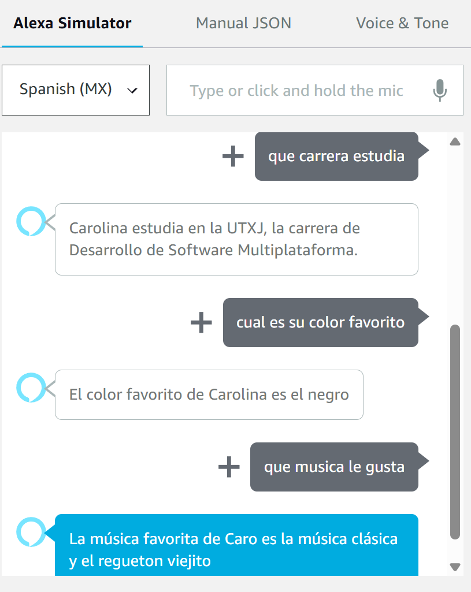
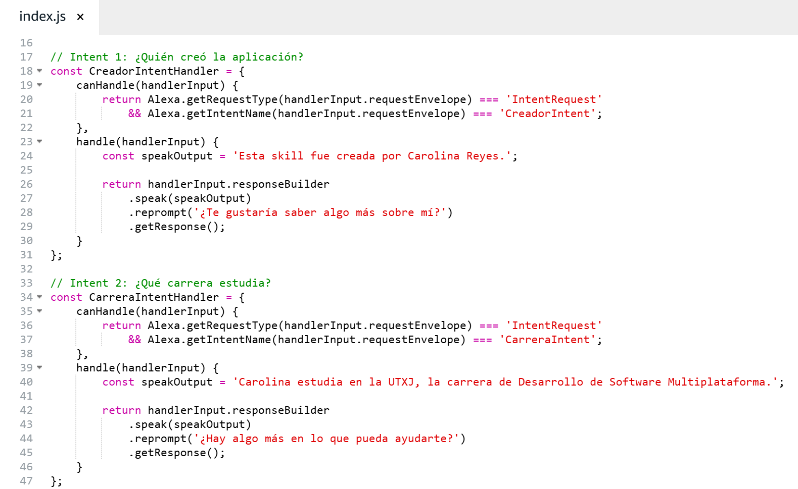
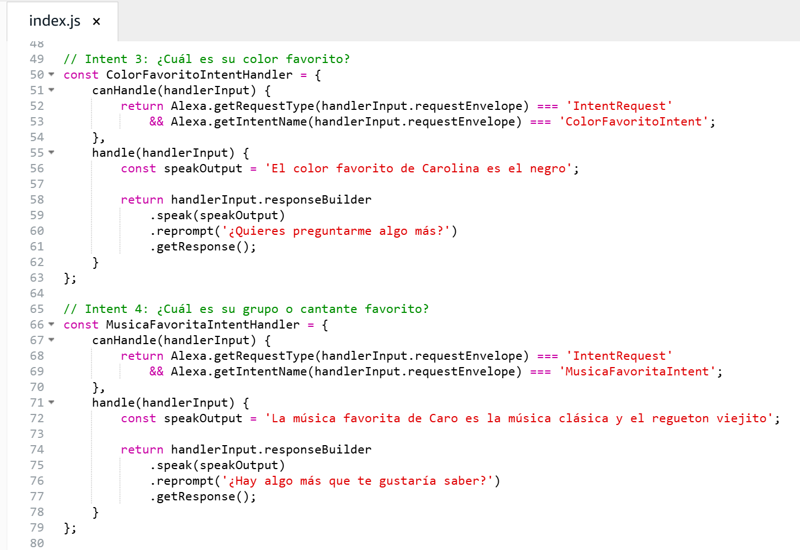

  
  

# Práctica03: FUNCIONALIDADES POR COMANDOS DE VOZ

## Elaborado por
### Carolina Arias Reyes
Grupo: 9A IDGS
Fecha: 14/05/2025
Asignatura: Extraccion de Conocimientos de Base de Datos
Profesor: Marco A. Ramírez Hernández

### Descripción de la Practica
En esta actividad, el estudiante actualizó una práctica previa con el objetivo de ampliar la funcionalidad de una aplicación conversacional mediante el reconocimiento y respuesta a cuatro preguntas específicas. La implementación consistió en permitir que el sistema identifique preguntas clave relacionadas con el creador de la aplicación, su carrera, su color favorito y su gusto musical, respondiendo a cada una de forma estática.

### Objetivo:
Mejorar la interacción de la aplicación mediante el uso de intents personalizados para responder a preguntas comunes relacionadas con el desarrollador.

Intents Agregados:
Se crearon los siguientes intents para manejar las nuevas preguntas:
CreadorIntent: responde quién creó la aplicación.
CarreraIntent: indica qué carrera estudia el creador.
ColorFavoritoIntent: menciona el color favorito del creador.
MusicaFavoritaIntent: responde cuál es el grupo o cantante favorito del creador.
Utterances Implementadas:
Se añadieron varias frases de ejemplo (utterances) para entrenar al sistema a reconocer las preguntas, tales como:

¿Quién creó esta aplicación?
¿Quién es tu creador?
¿Qué carrera estudia?
¿Cuál es su color favorito?
¿Qué música le gusta?

### Actividades Completadas:
Creación y configuración de los nuevos intents ✅

Incorporación de utterances correspondientes ✅

Programación de respuestas estáticas para cada intent ✅

Despliegue de la aplicación ✅

Pruebas funcionales para verificar el correcto reconocimiento y respuesta de los intents ✅

Descarga del código fuente ✅

Publicación del proyecto en un repositorio de GitHub ✅

## Evidencias

A continuación se presentan imágenes como evidencia de la práctica realizada:

### Capturas del Test

  

### Capturas del código

   

<!-- Puedes agregar más secciones o imágenes según lo necesites -->
